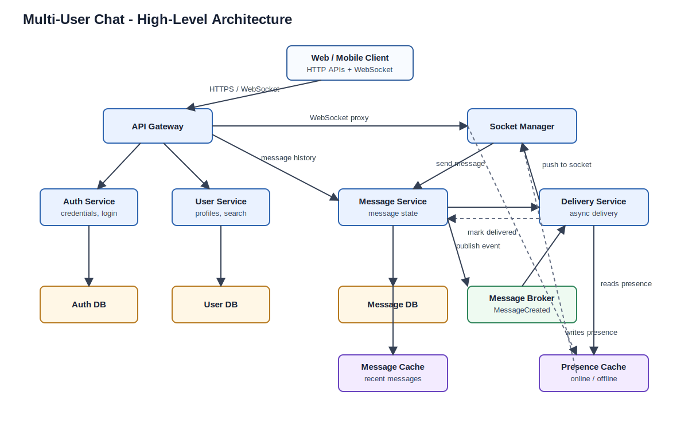
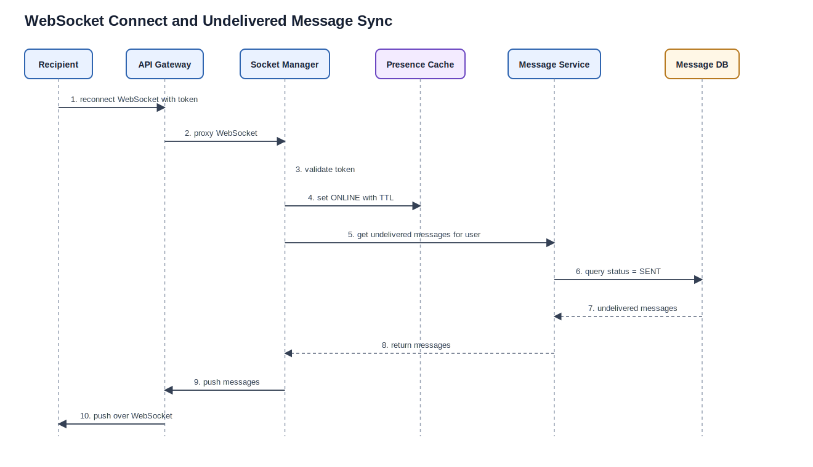
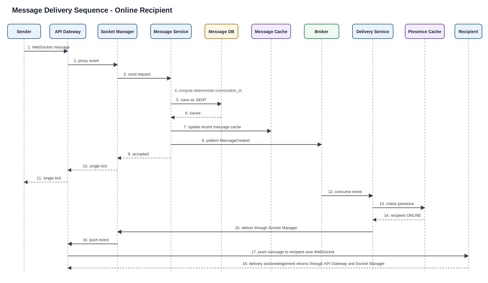

# Multi-User Chat Application - High-Level Design

## 1. Context

This document defines the high-level design for a scalable multi-user chat application for an organization with around 1,000,000 employees.

The current phase covers:

- User registration
- User login/logout
- Listing/searching users
- One-to-one chat
- Real-time message delivery
- Message history
- Single tick for server-accepted messages
- Double tick for delivered messages

Chatbot support is deferred to a later phase.

## 2. Design Goals

- Use a microservices architecture.
- Keep service boundaries clear.
- Use durable storage as the source of truth for messages.
- Use a message broker to decouple message persistence from delivery.
- Use cache for online/offline presence and hot recent chat reads.
- Avoid a separate Conversation Service for now.
- Support only one conversation between any two users.
- Keep the design scalable without overcomplicating the first implementation.

## 3. High-Level Architecture



## 4. Service Responsibilities

### 4.1 API Gateway

The API Gateway is the external entry point for both HTTP APIs and WebSocket traffic.

Responsibilities:

- Route registration and login requests to Auth Service.
- Route user listing/search requests to User Service.
- Route message history requests to Message Service.
- Route or proxy WebSocket connections to Socket Manager.
- Validate authentication tokens for protected APIs.
- Apply request-level controls such as rate limiting and basic validation.

Clients should not connect directly to Socket Manager. Socket Manager is an internal service behind API Gateway.

### 4.2 Auth Service

Auth Service owns identity and credential management.

Responsibilities:

- Register credentials.
- Validate login credentials.
- Issue authentication token/session.
- Logout or invalidate session.
- Store password hashes and auth metadata.

Auth Service owns Auth DB.

### 4.3 User Service

User Service owns user profile and discovery.

Responsibilities:

- Store user profile data.
- Enforce or coordinate username uniqueness.
- Return paginated users excluding the logged-in user.
- Support user search.

For scale, the system should not expose a literal unbounded `getAllUsers` API. It should provide paginated listing and search.

User Service owns User DB.

### 4.4 Socket Manager

Socket Manager owns live WebSocket session handling behind API Gateway.

Responsibilities:

- Authenticate WebSocket connections.
- Maintain active user socket sessions.
- Receive real-time client events.
- Forward send-message requests to Message Service.
- Push received messages to connected clients.
- Push delivery-status updates to senders.
- Write online/offline state to Presence Cache.
- On user reconnect, call Message Service to fetch undelivered messages.

At this stage, the design can assume a single Socket Manager instance. However, Presence Cache keeps the design compatible with future horizontal scaling.

### 4.5 Message Service

Message Service owns durable message state.

Responsibilities:

- Accept send-message requests.
- Validate sender and recipient.
- Compute deterministic `conversation_id` for a user pair.
- Persist messages in Message DB.
- Mark messages as `SENT` after durable persistence.
- Publish `MessageCreated` events to the Message Broker.
- Fetch message history by `conversation_id`.
- Fetch undelivered messages for a user.
- Update message status to `DELIVERED` when Delivery Service reports successful delivery.
- Own reads and writes for Message Cache.

Message DB remains the source of truth. Message Cache is only an optimization.

### 4.6 Delivery Service

Delivery Service owns async real-time delivery workflow.

Responsibilities:

- Consume `MessageCreated` events from Message Broker.
- Read Presence Cache to check whether the recipient is online.
- Ask Socket Manager to push messages to online recipients.
- Receive or process delivery acknowledgements.
- Notify Message Service to mark messages as `DELIVERED`.
- Trigger sender delivery-status updates through Socket Manager.
- Leave messages in `SENT` state when the recipient is offline.

### 4.7 Message Broker

Message Broker decouples message persistence from delivery.

Primary events:

- `MessageCreated`
- `MessageDelivered`

The critical ordering is:

```text
Message DB write succeeds -> MessageCreated event is published
```

The broker should not be the only durable location for messages.

## 5. Cache Usage

### 5.1 Presence Cache

Presence Cache tracks online/offline state.

Ownership rule:

```text
Socket Manager writes Presence Cache.
Delivery Service reads Presence Cache.
```

Example presence record:

```text
presence:{user_id}
- user_id
- socket_id
- connected_at
- last_seen_at
- status: ONLINE
- ttl
```

Presence Cache should have TTL-based expiry so stale connections do not remain online forever.

A separate Presence Service is not needed in the current design. It can be introduced later if presence logic becomes more complex or multiple services need to write presence state.

### 5.2 Message Cache

Message Cache accelerates hot chat reads.

Ownership rule:

```text
Message Service owns Message Cache reads and writes.
```

Example cache key:

```text
recent_messages:{conversation_id}
```

Use Message Cache for:

- recently active chat history
- last N messages for a conversation
- reducing Message DB reads when users open active chats

Do not use Message Cache for:

- durable message storage
- final delivery status source of truth
- guaranteed offline recovery

The write order should be:

```text
Message DB first, Message Cache second
```

If cache update fails, the system should continue using Message DB.

## 6. Data Model

### 6.1 User

```text
users
- user_id
- username
- first_name
- last_name
- created_at
- updated_at
```

### 6.2 Auth

```text
credentials
- user_id
- username
- password_hash
- created_at
- updated_at
```

### 6.3 Message

```text
messages
- message_id
- conversation_id
- from_user_id
- to_user_id
- body
- status
- created_at
- delivered_at
```

### 6.4 Optional Chat Index

This is not a separate service. It is an optional Message DB table to support chat list views efficiently.

```text
chats
- conversation_id
- user_low_id
- user_high_id
- last_message_id
- updated_at
```

## 7. Conversation ID Strategy

The system does not need a separate Conversation Service because there is only one conversation between any two users.

Message Service computes a deterministic `conversation_id`:

```text
conversation_id = hash(min(userA_id, userB_id) + ":" + max(userA_id, userB_id))
```

This ensures both users always resolve to the same conversation.

Benefits:

- No duplicate one-to-one conversations.
- Message history can be queried by one stable key.
- No separate Conversation Service is required.
- The design remains simple while still supporting efficient lookups.

## 8. Message Status

Supported statuses:

```text
SENT
DELIVERED
```

Meaning:

- `SENT`: message was durably saved by Message Service. Sender sees single tick.
- `DELIVERED`: recipient client acknowledged receipt. Sender sees double tick.

A message should not be marked `DELIVERED` merely because the backend attempted to push it. The recipient client must acknowledge receipt.

## 9. Sequence Diagrams

### 9.1 User Registration

```text
Client
  -> API Gateway: Register username, password, first name, last name
  -> Auth Service: Create credentials
  -> Auth DB: Check username and save password hash
  <- Auth DB: Credentials created
  -> User Service: Create user profile
  -> User DB: Save profile
  <- User DB: Profile created
  <- User Service: User profile created
  <- Auth Service: Registration success
  <- API Gateway: Registration success
```

### 9.2 Login

```text
Client
  -> API Gateway: Login username, password
  -> Auth Service: Authenticate
  -> Auth DB: Fetch credentials
  <- Auth DB: Password hash
  <- Auth Service: Auth token
  <- API Gateway: Login success with token
```

### 9.3 User Connects Over WebSocket



```text
Client -> API Gateway: Open WebSocket with auth token
API Gateway -> Socket Manager: Proxy WebSocket connection
Socket Manager -> Socket Manager: Validate token
Socket Manager -> Presence Cache: Set presence:{user_id} = ONLINE with TTL
Socket Manager -> Message Service: Get undelivered messages for user_id
Message Service -> Message DB: Query messages where to_user_id = user_id and status = SENT
Message DB -> Message Service: Undelivered messages
Message Service -> Socket Manager: Undelivered messages
Socket Manager -> API Gateway: Push undelivered messages
API Gateway -> Client: Push undelivered messages
```

### 9.4 Send Message to Online User



```text
Sender Client -> API Gateway: Send WebSocket message to recipient
API Gateway -> Socket Manager: Proxy message event
Socket Manager -> Message Service: Send message request
Message Service -> Message Service: Compute conversation_id
Message Service -> Message DB: Save message with status SENT
Message DB -> Message Service: Message saved
Message Service -> Message Cache: Update recent_messages:{conversation_id}
Message Service -> Message Broker: Publish MessageCreated
Message Service -> Socket Manager: Message accepted with status SENT
Socket Manager -> API Gateway: Single tick
API Gateway -> Sender Client: Single tick

Message Broker -> Delivery Service: Consume MessageCreated
Delivery Service -> Presence Cache: Check recipient presence
Presence Cache -> Delivery Service: Recipient ONLINE
Delivery Service -> Socket Manager: Deliver message to recipient
Socket Manager -> API Gateway: Push message through WebSocket
API Gateway -> Recipient Client: Push message
Recipient Client -> API Gateway: Delivery acknowledgement
API Gateway -> Socket Manager: Delivery acknowledgement
Socket Manager -> Delivery Service: Delivery acknowledgement
Delivery Service -> Message Service: Mark message DELIVERED
Message Service -> Message DB: Update status to DELIVERED
Message Service -> Message Cache: Update cached message status
Message Service -> Delivery Service: Status updated
Delivery Service -> Socket Manager: Notify sender of delivery
Socket Manager -> API Gateway: Push delivery status
API Gateway -> Sender Client: Double tick
```

### 9.5 Send Message to Offline User

```text
Sender Client -> API Gateway: Send WebSocket message to offline recipient
API Gateway -> Socket Manager: Proxy message event
Socket Manager -> Message Service: Send message request
Message Service -> Message Service: Compute conversation_id
Message Service -> Message DB: Save message with status SENT
Message DB -> Message Service: Message saved
Message Service -> Message Broker: Publish MessageCreated
Message Service -> Socket Manager: Message accepted with status SENT
Socket Manager -> API Gateway: Single tick
API Gateway -> Sender Client: Single tick

Message Broker -> Delivery Service: Consume MessageCreated
Delivery Service -> Presence Cache: Check recipient presence
Presence Cache -> Delivery Service: Recipient OFFLINE or missing
Delivery Service -> Delivery Service: Leave message as SENT
```

### 9.6 Offline User Reconnects

```text
Recipient Client -> API Gateway: Reconnect WebSocket
API Gateway -> Socket Manager: Proxy WebSocket connection
Socket Manager -> Socket Manager: Validate token
Socket Manager -> Presence Cache: Set presence:{user_id} = ONLINE with TTL
Socket Manager -> Message Service: Get undelivered messages for user_id
Message Service -> Message DB: Query messages where to_user_id = user_id and status = SENT
Message DB -> Message Service: Undelivered messages
Message Service -> Socket Manager: Return undelivered messages
Socket Manager -> API Gateway: Push undelivered messages
API Gateway -> Recipient Client: Push undelivered messages
Recipient Client -> API Gateway: Delivery acknowledgement
API Gateway -> Socket Manager: Proxy delivery acknowledgement
Socket Manager -> Delivery Service: Delivery acknowledgement
Delivery Service -> Message Service: Mark messages DELIVERED
Message Service -> Message DB: Update statuses to DELIVERED
Message Service -> Delivery Service: Status updated
Delivery Service -> Socket Manager: Notify senders of delivery
Socket Manager -> API Gateway: Push delivery status
API Gateway -> Sender Client: Double tick if sender is online
```

### 9.7 Fetch Recent Chat History

```text
Client
  -> API Gateway: Open chat with user_id
  -> Message Service: Fetch recent messages
  -> Message Service: Compute conversation_id
  -> Message Cache: Read recent_messages:{conversation_id}

If cache hit:
  <- Message Cache: Recent messages
  <- Message Service: Recent messages
  <- API Gateway: Recent messages

If cache miss:
  -> Message DB: Fetch recent messages by conversation_id
  <- Message DB: Recent messages
  -> Message Cache: Hydrate recent_messages:{conversation_id}
  <- Message Service: Recent messages
  <- API Gateway: Recent messages
```

## 10. Key Design Decisions

| Decision | Rationale |
| --- | --- |
| Use Message Broker | Decouples message persistence from delivery and helps absorb traffic spikes. |
| Separate Message Service and Delivery Service | Keeps durable message ownership separate from async delivery workflow. |
| No Conversation Service | Only one conversation exists between any two users; Message Service can compute `conversation_id`. |
| Use Presence Cache | Fast online/offline checks for delivery decisions. |
| Use Message Cache | Faster access to recent active chat messages. |
| DB before broker/cache | Message DB remains the durable source of truth. |
| Socket Manager writes presence | Keeps presence ownership clear. |
| Delivery Service reads presence | Enables fast online/offline delivery decisions. |

## 11. Future Enhancements

These are not required for the current phase but should be considered later:

- Multiple Socket Manager instances.
- Presence Service if presence logic becomes complex.
- Group chat.
- Read receipts.
- Typing indicators.
- Push notifications.
- Attachments.
- Message search.
- Chatbot integration.
- Multi-device support.
- Rich user presence and last-seen privacy controls.
